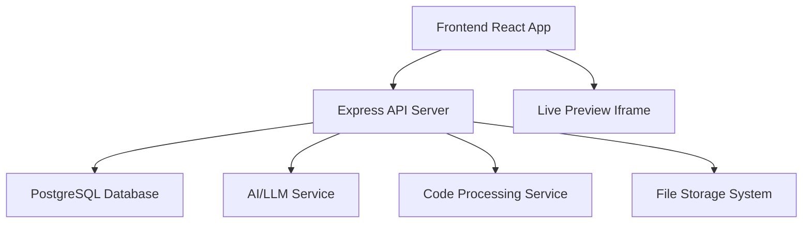

# Design Document

## Overview

The Lovable.dev clone will be a full-stack web application that enables users to create web applications through natural language prompts. The system will leverage AI/LLM integration to generate code, provide a real-time preview environment, and offer project management capabilities.

## Architecture

The application follows a modern three-tier architecture:

### Frontend (React + TypeScript)
- **User Interface**: Clean, modern interface with prompt input, code editor, and live preview
- **State Management**: Redux Toolkit for global state management
- **Code Editor**: Monaco Editor (VS Code editor) for syntax highlighting and code editing
- **Preview System**: Sandboxed iframe for safe code execution and preview

### Backend (Node.js + Express)
- **API Layer**: RESTful API endpoints for project management, code generation, and user authentication
- **AI Integration**: Integration with OpenAI GPT-4 or similar LLM for code generation
- **Code Processing**: Code validation, bundling, and transformation services
- **File Management**: Project file storage and version control

### Database (PostgreSQL)
- **User Management**: User accounts, authentication, and session management
- **Project Storage**: Project metadata, code files, and version history
- **Usage Tracking**: Analytics and usage metrics



## Components and Interfaces

### Frontend Components

#### 1. Main Application Shell
- **Header**: Navigation, user menu, project selector
- **Sidebar**: Project list, file explorer, settings
- **Main Content**: Prompt input, code editor, preview pane

#### 2. Prompt Interface
```typescript
interface PromptInterface {
  input: string;
  onSubmit: (prompt: string) => void;
  isLoading: boolean;
  suggestions: string[];
}
```

#### 3. Code Editor
```typescript
interface CodeEditorProps {
  files: ProjectFile[];
  activeFile: string;
  onFileChange: (filename: string, content: string) => void;
  onFileSelect: (filename: string) => void;
}
```

#### 4. Live Preview
```typescript
interface PreviewProps {
  projectId: string;
  files: ProjectFile[];
  isLoading: boolean;
}
```

### Backend API Endpoints

#### Authentication
- `POST /api/auth/register` - User registration
- `POST /api/auth/login` - User login
- `POST /api/auth/logout` - User logout
- `GET /api/auth/me` - Get current user

#### Projects
- `GET /api/projects` - List user projects
- `POST /api/projects` - Create new project
- `GET /api/projects/:id` - Get project details
- `PUT /api/projects/:id` - Update project
- `DELETE /api/projects/:id` - Delete project

#### Code Generation
- `POST /api/generate` - Generate code from prompt
- `POST /api/iterate` - Iterate on existing code
- `POST /api/validate` - Validate generated code

#### File Management
- `GET /api/projects/:id/files` - Get project files
- `PUT /api/projects/:id/files/:filename` - Update file content
- `POST /api/projects/:id/export` - Export project

## Data Models

### User Model
```typescript
interface User {
  id: string;
  email: string;
  username: string;
  passwordHash: string;
  createdAt: Date;
  updatedAt: Date;
}
```

### Project Model
```typescript
interface Project {
  id: string;
  userId: string;
  name: string;
  description: string;
  files: ProjectFile[];
  prompts: PromptHistory[];
  createdAt: Date;
  updatedAt: Date;
}
```

### Project File Model
```typescript
interface ProjectFile {
  id: string;
  projectId: string;
  filename: string;
  content: string;
  type: 'html' | 'css' | 'js' | 'json';
  createdAt: Date;
  updatedAt: Date;
}
```

### Prompt History Model
```typescript
interface PromptHistory {
  id: string;
  projectId: string;
  prompt: string;
  response: string;
  filesChanged: string[];
  createdAt: Date;
}
```

## Error Handling

### Frontend Error Handling
- **Global Error Boundary**: Catch and display React component errors
- **API Error Handling**: Centralized error handling for API calls with user-friendly messages
- **Code Editor Errors**: Real-time syntax error detection and highlighting
- **Preview Errors**: Safe error handling in sandboxed preview environment

### Backend Error Handling
- **Validation Errors**: Input validation with detailed error messages
- **Authentication Errors**: Proper HTTP status codes and security measures
- **AI Service Errors**: Fallback handling for AI service failures
- **Database Errors**: Connection handling and transaction rollbacks

### Error Response Format
```typescript
interface ErrorResponse {
  error: {
    code: string;
    message: string;
    details?: any;
  };
}
```

## Testing Strategy

### Frontend Testing
- **Unit Tests**: Jest + React Testing Library for component testing
- **Integration Tests**: Testing user workflows and API integration
- **E2E Tests**: Cypress for full application testing
- **Visual Regression**: Chromatic for UI consistency

### Backend Testing
- **Unit Tests**: Jest for individual function testing
- **Integration Tests**: Supertest for API endpoint testing
- **Database Tests**: Test database operations with test database
- **AI Integration Tests**: Mock AI responses for consistent testing

### Code Generation Testing
- **Prompt Testing**: Test various prompt types and edge cases
- **Code Validation**: Ensure generated code is syntactically correct
- **Preview Testing**: Verify generated applications work in preview
- **Security Testing**: Ensure generated code doesn't contain vulnerabilities

## Security Considerations

### Authentication & Authorization
- JWT tokens for session management
- Password hashing with bcrypt
- Rate limiting on API endpoints
- CORS configuration for frontend-backend communication

### Code Execution Security
- Sandboxed iframe for code preview
- Content Security Policy (CSP) headers
- Input sanitization for user prompts
- Code validation before execution

### Data Protection
- Environment variables for sensitive configuration
- Database connection encryption
- User data encryption at rest
- Secure file upload and storage

## Performance Optimization

### Frontend Performance
- Code splitting and lazy loading
- Memoization for expensive computations
- Virtual scrolling for large file lists
- Debounced API calls for real-time features

### Backend Performance
- Database indexing for common queries
- Caching for frequently accessed data
- Connection pooling for database connections
- Async processing for code generation

### AI Integration Optimization
- Request batching for multiple file generation
- Caching of common prompt responses
- Streaming responses for real-time feedback
- Fallback mechanisms for service unavailability